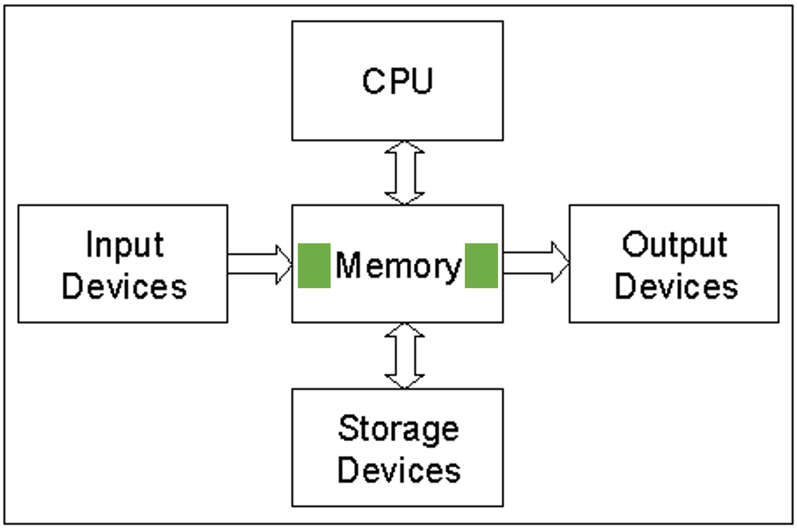
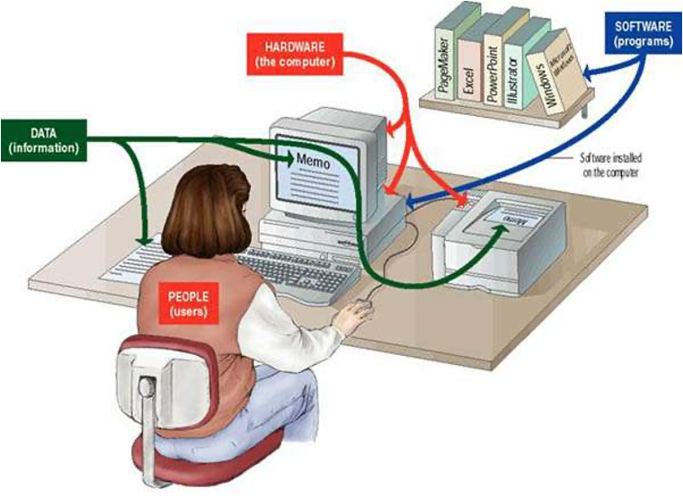
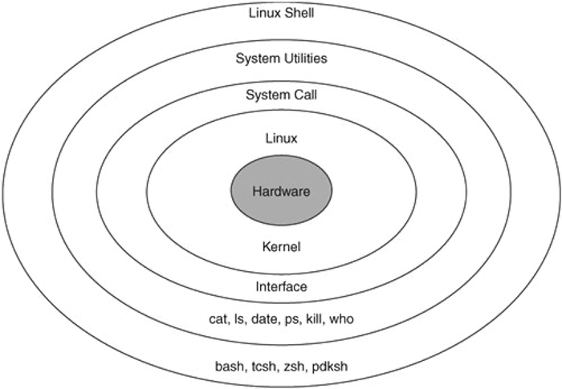
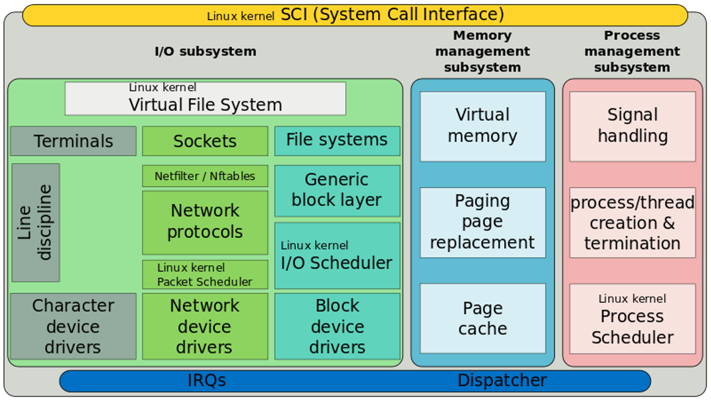
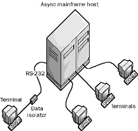

# 실전코딩 2 실습 리포트

### `sshid` : pcc001
### `name` : 곽수정 ✨
### `id` : 201921085

***

## Lecture 1  

##### - 2022. 01. 04   [ C Development Platform ]  

* git을 사용하기 위한 프로그램 설치

* Basic Linux Command

`ls`

현재 디렉토리에 어떤 파일이 있는지 list를 보여주는 명령어  

```
$ ls -l                   ; 파일의 상세 정보 표시
$ ls -a                   ; 숨어있는 파일들도 표시
$ ls -al pcc001           ; pcc001 디렉토리의 모든 파일 표시
```

`pwd`  

print working directory : 현재 디렉토리 보여줌  

`hostname`  
내가 지금 어떤 컴퓨터를 쓰는지 알고싶다면 사용  

```
$ hostname  
Kwakui-MacBookPro.local
```

`who`  
컴퓨터에 누가 들어왔는지 보고싶을 때 사용  
호스트에 로그인한 사용자의 정보를 출력

`wc`  
word count  
주어지는 파일 또는 표준 입력의 바이트, 문자, 단어 그리고 줄(라인) 수를 출력해주는 명령어

`who | wc`  
who의 output이 다음 명령 wc에 들어감 : 현재 접속자 수 보여줌  

`who | sort`  
who의 output 정렬해서 보여줌

`mkdir`  
디렉토리 생성하는 명령어  

```
$ mkdir pcc         ; pcc 디렉토리 생성, 이미 디렉토리가 존재한다면 에러 발생
```  

`cd`  
change directory  
디렉토리를 이동하는 명령어

```
$ cd                ; cd 뒤에 디렉토리 입력 안하면 home directory로 이동
$ cd ~              ; home directory로 이동, 위 명령어와 동일
$ cd ..             ; 윗 디렉토리로 이동
$ cd lec01          ; lec01 디렉토리로 이동
```

`vi hello.c`  
vi 에디터로 파일 생성 후 편집  

 * 3가지 mode: normal, insert, command mode  

    * normal 모드에서 i 를 눌러 insert mode로 전환 후 타이핑  

        * 한 글자 지우기: delete 키 / x 키, undo: u 키, 커서 뒤에 append: a 키  

    * insert mode에서 esc 눌러 빠져나오면 normal mode로 전환됨  

    * normal mode에서 command mode로 들어가려면 : 누름  

        * ex) **:wq** = write & quit  


`cc hello.c`  
hello.c 파일 컴파일 -> 기본적으로 a.out 실행파일 생성됨  

`mv`  
파일을 이동시키는 명령어  

```
$ mv a.out hello.c pcc            ; a.out와 hello.c 파일을 pcc 디렉토리로 이동시킴  
$ mv hello.c hola.c               ; hello.c 파일의 이름을 hola.c 로 변경 가능
```

_cp는 원본 파일이 남아있지만 mv는 원본 파일이 남아있지 않아 파일 이름 변경시에도 사용 가능하다._  

`passwd`  
비밀번호 변경 가능, 현재 비밀번호 입력한 뒤 새로운 비밀번호로 변경  

`chmod`  
파일의 모드를 변경하는 명령어
  
| 파일 소유자 | 그룹 | 그 외 사용자 |
|:--------:|:----:|:--------:|
|read, write, execute| read, write, execute | read, write, execute|
|4 2 1| 4 2 1 | 4 2 1 |

|  변경 전  |  명령어  |  변경 후  |
|:-------:|:-------:|:-------:|
|drwxrwxrwx| chmod 700 pcc001 | drwx------|
| drwx------| chmod 777 forAll | drwxrwxrwx|  

* 예시) `drwxrw----- pcc039 pcc forAll`  
    * forAll이라는 디렉토리의 소유자는 pcc039이며 그룹은 pcc 이다.
    * 디렉토리의 소유자인 pcc039는 read, write, execute 권한을 가진다.
    * 그룹 pcc에 속한 사용자는 read와 write 권한을 갖는다.
    * 그 외 사용자는 아무 권한도 갖지 않는다.
    * _super user는 항상 모든 권한을 갖고 있다._

* 예시) `d---rwx--- pcc039 pcc forAll`
    * 디렉토리의 소유자인 pcc039는 아무 권한도 갖지 않는다.
    * 따라서 소유자 pcc039는 forAll 디렉토리에 들어가지 못한다!
    * **디렉토리에 들어가려면 실행 권한(x = execute)이 필요하다.**
    * 디렉토리 소유자와 others는 아무 권한이 없고, pcc group에 속한 사용하즌 read, write, execute 권한을 갖는다.

* 예시) `d---rwxrwx pcc039 pcc forAll`
    * forAll 디렉토리에 들어갈 수 있는 사람은 소유자 pcc039 빼고 모두이다.  
    즉, group에 속한 사용자, 그 외 사용자, 그리고 super user이다.
    * super user = root = 이 기계를 관리하는 사람

`groups`  
내가 속한 그룹 보여줌

`whoami`  
현재 로그인한 사용자의 id 출력
```
$ whoami
pcc001
```

`cat`  
어떤 파일의 내용을 보는 명령어
```
$ cat hello.c
#include <stdio.h>

int main()
{
	printf("Hello World \n"); //Comment
}
```

`whoami >> output`  
whoami의 결과인 pcc001이 output 파일에 추가됨

`history`  
내가 입력한 명령어 이력들 보기  

***

## Lecture 2
  
##### - 2022. 01. 05 [ Advanced C 언어 (1) 및 편집 도구 ]  
  

`Computer Hardware System`  

  

_lec01 실습: output device에 Hello World를 출력하도록 명령함  
실행 파일명: a.out_  

* CPU: central processing unit  
* Memory: RAM, ROM  
* Input Devices: 키보드, 마우스, 마이크  
* Output Devices: 모니터, 프린터, 스피커  
* Storage Devices: hhd, ssd, 파일이 들어있는 곳

**Q**) Storage에 들어있는 a.out 파일을 CPU가 바로 실행할 수 있다? [ **X** ]
> CPU는 storage device에 들어있는 파일을 직접 실행할 수 있는 경우가 없다!

**Q**) CPU는 output device에 데이터를 내보낼 수 있다? [ **X** ]
> 직접 output device에 데이터를 내보낼 수 없다! 따라서 메모리에 두어야함.  

* Storage에 저장되어 있는 a.out 프로그램을 실행하려면 메모리에 두어야하고, 그럼 CPU가 메모리에서 하나씩 가져다가 실행함  

* 메모리 중에서 초록색으로 표시된 부분은? **buffer**
> input device가 쓰는 버퍼: input buffer  
> output device가 쓰는 버퍼: output buffer  

`Computer system 구성요소`  



* User, data, hardware, software 로 구성되어 있다.

`Software`  
* Application software  
* System software: os, compiler, device driver  
    * system software, os: 사용자가 하드웨어를 쓰기 쉽게 해주는 기능 제공
    * os ( 운영체제 ): 하드웨어 바로 위에 존재  

  

* bash: git-scm 설치 후 프롬프트 나오고 대화형으로 이 유틸리티를 사용할 수 있도록 만들어주는 것

* HW에 Hello world! 가 출력 되려면?  
    * hello.c를 컴파일해서 a.out 이라는 app 을 만든다. -> bash에서 a.out을 실행시킨다.  
    * HW에 출력하기 위해 shell에서 실행되어 system call 중 printf를 사용하여 커널에게 요청하고, 커널이 hw에게 출력하기를 요청하여 모니터에 Hello World! 가 출력된다.  

`Linux kernel`

  

* Linux Kernel에서도 위 **Computer hardware system** 그림에서 볼 수 있는 5가지 구성 요소를 모두 가지고 있다.  
즉 OS는 Input & Output device, Memory, CPU, Storage devices와 같은 hw를 사용자가 사용하기 쉽게 만들어준다.

* Linux kernel & Computer hardware system
    * I/O subsystem - _Input & Output device_
    * Memory management subsystem - _Memory_
    * Process management subsystem - _CPU_
    * File systems - _Storage devices_  

* 위로 갈 수록 sw, 아래로 갈 수록 hw와 가깝다. 예를 들어 Network 장치를 이용한 통신을 위한 sw는 socket이다.  

* Processor != Process != Thread  

  

* Terminal을 이해하기 위해서는 옛날 컴퓨터 사용방법 생각해보기  
    * 하나의 컴퓨터에 통신선을 통해 터미널과 연결하여 사용했었음  
    * 옛날에 사용하던 터미널에도 CPU, memory, I/O device 등 존재했지만 실제로 계산하는 중심적인 서비스를 제공하는 것은 async mainframe host였기 때문에 상대적으로 터미널(단말)이라고 불렀다.  

* 사용자가 hw를 사용하기 편리하도록 기본적으로 설치되는 시스템 소프트웨어: 운영체제  

* 터미널 앞에는 컴퓨터의 4대 구성요소 중 하나인 user가 있고, HW 관점으로 봤을 때 사용자와 직접적으로 맞닥뜨리는 종점( 단말 )이 **Terminal**이다.  

* Terminal = character device = Input 장치이면서 output 장치이다.  

`Lec02 실습`

* 리눅스에서는 모든 컴퓨터 자원, resource를 파일로 관리한다.  

* git bash를 여는 순간 터미널이 열린다. 터미널의 타입을 xterm-256color로 설정하면 색이 설정되어 나온다.

* $ = prompt = 예전에는 컴퓨터 사용하는 시간만큼 돈을 냈었다.  

* 명령어를 기다리고 있다가 명령어를 수행하는 프로그램 이름은? **shell**

`ssh`  
리눅스 서버에 원격 접속할 때 사용하는 명령어
```
$ ssh pcc001@git.ajou.ac.kr
```

`ps`  
내가 실행하는 process 보고 싶을 때 사용하는 명령어  

```
$ ps
    PID    TTY      TIME        CMD
    5655   pts/8    00:00:00    bash
    9159   pts/8    00:00:00    ps
```
_bash를 실행하는 중 & ps 명령어도 실행되고 있었으므로 표시됨_  
* `PID` = process id = 리눅스 내부에서는 process들이 번호로 관리됨  
* `TTY` = terminal  

`tty`  

//40분 19초

***

## Lecture 3  

##### - 2022. 01. 06 [ Advanced C 언어 (2) 및 편집 도구 ]

### linux command

교수님의 코드를 카피함

```
cp ~hwan/.profile  ~hwan/.bashrc  ~hwan/.bash_logout ~
source .profile
```

이렇게 하니까 프롬프트가 초록색이 됨

***

## Lecture 4  

##### - 2022. 01. 10

***

## Lecture 5
##### - 2022. 01. 11

***